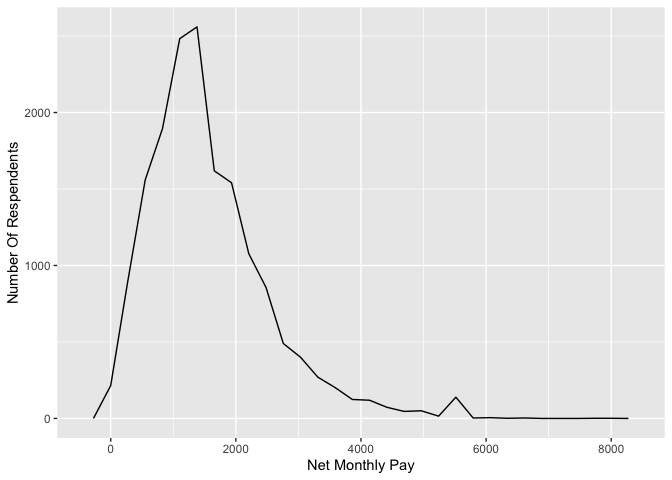
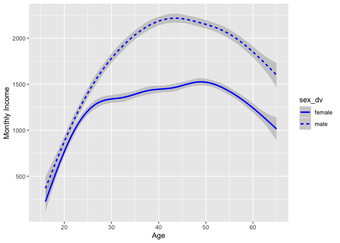
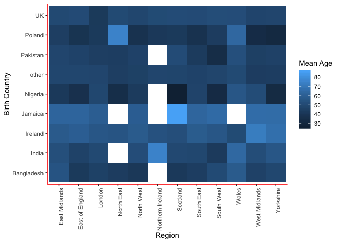
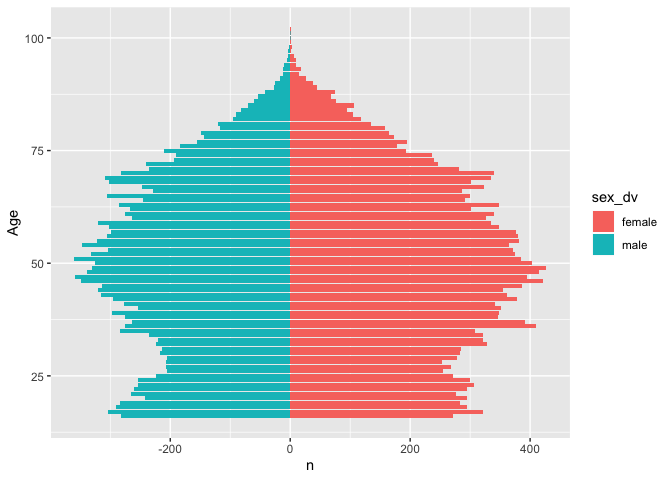

Statistical assignment 4
================
visuth yanamorn
01/03/2020

In this assignment you will need to reproduce 5 ggplot graphs. I supply
graphs as images; you need to write the ggplot2 code to reproduce them
and knit and submit a Markdown document with the reproduced graphs (as
well as your .Rmd file).

First we will need to open and recode the data. I supply the code for
this; you only need to change the file paths.

    ```r
    library(tidyverse)
    Data8 <- read_tsv("/Users/vy210/Documents/data analysis/assignment4/data/UKDA-6614-tab/tab/ukhls_w8/h_indresp.tab")
    Data8 <- Data8 %>%
        select(pidp, h_age_dv, h_payn_dv, h_gor_dv)
    Stable <- read_tsv("/Users/vy210/Documents/data analysis/assignment4/data/UKDA-6614-tab/tab/ukhls_wx/xwavedat.tab")
    Stable <- Stable %>%
        select(pidp, sex_dv, ukborn, plbornc)
    Data <- Data8 %>% left_join(Stable, "pidp")
    rm(Data8, Stable)
    Data <- Data %>%
        mutate(sex_dv = ifelse(sex_dv == 1, "male",
                           ifelse(sex_dv == 2, "female", NA))) %>%
        mutate(h_payn_dv = ifelse(h_payn_dv < 0, NA, h_payn_dv)) %>%
        mutate(h_gor_dv = recode(h_gor_dv,
                         `-9` = NA_character_,
                         `1` = "North East",
                         `2` = "North West",
                         `3` = "Yorkshire",
                         `4` = "East Midlands",
                         `5` = "West Midlands",
                         `6` = "East of England",
                         `7` = "London",
                         `8` = "South East",
                         `9` = "South West",
                         `10` = "Wales",
                         `11` = "Scotland",
                         `12` = "Northern Ireland")) %>%
        mutate(placeBorn = case_when(
                ukborn  == -9 ~ NA_character_,
                ukborn < 5 ~ "UK",
                plbornc == 5 ~ "Ireland",
                plbornc == 18 ~ "India",
                plbornc == 19 ~ "Pakistan",
                plbornc == 20 ~ "Bangladesh",
                plbornc == 10 ~ "Poland",
                plbornc == 27 ~ "Jamaica",
                plbornc == 24 ~ "Nigeria",
                TRUE ~ "other")
        )
    ```

Reproduce the following graphs as close as you can. For each graph,
write two sentences (not more\!) describing its main message.

1.  Univariate distribution (20 points).
    
    ``` r
    Plot_1 <- ggplot(data= Data, aes(x=h_payn_dv)) +
        geom_freqpoly() + xlab("Net Monthly Pay") +
        ylab("Number Of Respendents")
    Plot_1
    ```
    
    <!-- -->
    \#the graph shows that most people earn around 1500 per month. the
    distribution is slopping to the left suggesting that the higher
    salaries are more variable.

2.  Line chart (20 points). The lines show the non-parametric
    association between age and monthly earnings for men and
    women.
    
    ``` r
    Plot_2 <- ggplot(data= Data, aes(x = h_age_dv,y=h_payn_dv, group = sex_dv))+ geom_smooth(aes(linetype = sex_dv), color = "blue") + xlim(15,65) +
        xlab("Age") +
        ylab("Monthly Income")
    Plot_2
    ```
    
    <!-- -->
    \#the graph shows that men usually make more money than women. the
    big gap between men and women salary is between aged 30 to 45.

3.  Faceted bar chart (20 points).
    
    ``` r
    data_median <- Data %>%
        filter(!is.na(sex_dv)) %>%
        filter(!is.na(placeBorn)) %>%
        group_by(sex_dv, placeBorn) %>%
        summarise(medianIncome = median(h_payn_dv, na.rm = TRUE))
    
    Plot_3 <- ggplot(data_median, aes(x=sex_dv, y=medianIncome)) +
        geom_bar(stat = "Identity") +
        facet_wrap(~ placeBorn) +
        xlab("Sex") +
        ylab("Median monthly net pay")
    Plot_3
    ```
    
    <!-- -->
    \#the men median monthly new pay is always greater than women
    regardless of the country of bitrh.

4.  Heat map (20 points).
    
    ``` r
    Heatmap <- Data %>%
        group_by(h_gor_dv, placeBorn) %>%
        summarise(MeanAge = mean(h_age_dv)) %>%
        filter(!is.na(h_gor_dv), !is.na(placeBorn))
    
    plot_4 <- ggplot(Heatmap, aes(x = h_gor_dv, y = placeBorn, fill= MeanAge)) +
        geom_tile() +
        xlab("Region") +
        ylab("Birth Country") +
        labs(fill = "Mean Age") +
        theme(panel.grid.major = element_blank(), panel.grid.minor = element_blank(), panel.background = element_blank(), axis.line = element_line(colour = "red")) +
        theme(axis.text.x = element_text(angle = 90,hjust = 1))
    plot_4
    ```
    
    <!-- -->
    \#the map shows that the youngest individuals in the study lives in
    scotland but were born in Nigeria with the mean age at 30. the
    oldest individuals also live in scotland but were born in Jamaica.

5.  Population pyramid (20
    points).
    
    ``` r
    plot_5 <- ggplot(data = Data, mapping = aes(x = h_age_dv, fill = sex_dv)) + 
        geom_bar(data = subset(Data, sex_dv == "female")) +
        geom_bar(data = subset(Data, sex_dv == "male"), aes(y = ..count..*(-1))) +
        coord_flip() +
        xlab("Age") +
        ylab("n")
    labs(fill = "sex")
    ```
    
        ## $fill
        ## [1] "sex"
        ## 
        ## attr(,"class")
        ## [1] "labels"
    
    ``` r
    plot_5
    ```
    
    <!-- -->
    \#the pyramid shows that there are more female respondents than male
    across the entire age distribution. most of the respondents aged
    between 45 and 55.
